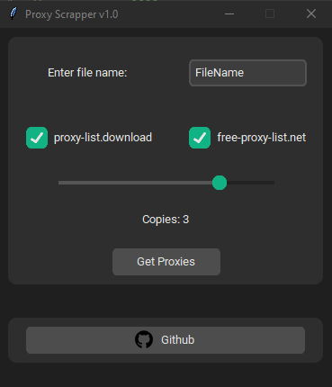

<h1 align="center">Welcome to Python proxy scrapper 👋</h1>
<p>
  
  
  
</p>

> Program made with python to understand the language a little. It gets proxies from two different websites, you can tell it the copies you want it to make of the file.



## Install

You need to have [Python](https://www.python.org/downloads/) installed and install the project requirements.

```sh
pip install -r requirements.txt
```

## Usage

```sh
python proxy_scrapper.py
```

## Compile to .exe

To compile the script into an .exe you just have to have [pyinstaller](https://pyinstaller.org/en/stable/) installed.

```sh
pip install -U pyinstaller
```

And just run:

```sh
pyinstaller .\proxy_scrapper.spec
```

## Author

👤 **Vicente**

- Github: [@vicnx](https://github.com/vicnx)

## Show your support

Give a ⭐️ if this project helped you!
